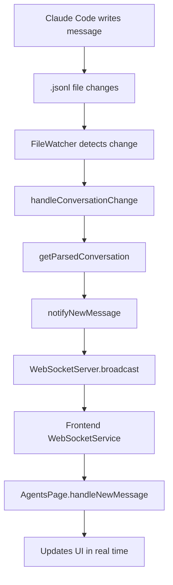

[](https://www.npmjs.com/package/claude-code-templates)
[](https://www.npmjs.com/package/claude-code-templates)
[](https://opensource.org/licenses/MIT)
[](https://opensource.org/)
[](CONTRIBUTING.md)
[](https://github.com/davila7/claude-code-templates)
[](https://www.deepgraph.co/davila7/claude-code-templates)

**CLI tool for configuring and monitoring Claude Code** - Quick setup for any project with framework-specific commands and real-time monitoring dashboard. Open source and runs locally.

🌐 **[Browse Templates Online](https://davila7.github.io/claude-code-templates/)** - Explore all available templates with interactive previews and installation commands.


## 📋 Quick Start

```bash
# Run the tool (no installation required!)

npx claude-code-templates@latest

```


---

##

```bash
# Navigate to your project
cd your-project-directory

# Run the tool (no installation required!)
npx claude-code-templates@latest

```

You'll see an interactive welcome screen:


```bash

 ██████╗██╗      █████╗ ██╗   ██╗██████╗ ███████╗
██╔════╝██║     ██╔══██╗██║   ██║██╔══██╗██╔════╝
██║     ██║     ███████║██║   ██║██║  ██║█████╗  
██║     ██║     ██╔══██║██║   ██║██║  ██║██╔══╝  
╚██████╗███████╗██║  ██║╚██████╔╝██████╔╝███████╗
 ╚═════╝╚══════╝╚═╝  ╚═╝ ╚═════╝ ╚═════╝ ╚══════╝

 ██████╗ ██████╗ ██████╗ ███████╗
██╔════╝██╔═══██╗██╔══██╗██╔════╝
██║     ██║   ██║██║  ██║█████╗  
██║     ██║   ██║██║  ██║██╔══╝  
╚██████╗╚██████╔╝██████╔╝███████╗
 ╚═════╝ ╚═════╝ ╚═════╝ ╚══════╝

████████╗███████╗███╗   ███╗██████╗ ██╗      █████╗ ████████╗███████╗███████╗
╚══██╔══╝██╔════╝████╗ ████║██╔══██╗██║     ██╔══██╗╚══██╔══╝██╔════╝██╔════╝
   ██║   █████╗  ██╔████╔██║██████╔╝██║     ███████║   ██║   █████╗  ███████╗
   ██║   ██╔══╝  ██║╚██╔╝██║██╔═══╝ ██║     ██╔══██║   ██║   ██╔══╝  ╚════██║
   ██║   ███████╗██║ ╚═╝ ██║██║     ███████╗██║  ██║   ██║   ███████╗███████║
   ╚═╝   ╚══════╝╚═╝     ╚═╝╚═╝     ╚══════╝╚═╝  ╚═╝   ╚═╝   ╚══════╝╚══════╝

🚀 Welcome to Claude Code Templates!

¿What would you like to do?
❯ 📊 Analytics Dashboard - Monitor your Claude Code usage and sessions
  🔍 Health Check - Validate your Claude Code configuration and system
  ⚙️ Project Setup - Configure Claude Code for your project
```

**Choose your path:**
- **📊 Analytics Dashboard**: View your Claude Code sessions, usage patterns, and performance metrics
- **🔍 Health Check**: Comprehensive system validation and configuration verification
- **⚙️ Project Setup**: Configure Claude Code for your project with framework-specific commands and hooks
  

```bash
# Start coding with Claude
claude
```

## Core Features

### 📊 Real-time Analytics Dashboard
Monitor and optimize your Claude Code agents with our comprehensive analytics dashboard:
- **Live Session Tracking**: See active conversations and their status in real-time
- **Usage Statistics**: Total sessions, tokens, and project activity with trends
- **Conversation History**: Complete session logs with export capabilities (CSV/JSON)
- **Status Indicators**: PM2-style visual indicators for conversation health
- **File Watching**: Automatic updates as you work with Claude Code
- **Web Interface**: Clean, terminal-style dashboard at `http://localhost:3333`
- **Performance Monitoring**: Track Claude Code agent performance and optimization opportunities
- **Usage Patterns**: Identify your most productive coding sessions and workflows

### 🤖 Agent Chats Manager
Monitor and analyze Claude agent interactions in real-time


### 🔍 Comprehensive Health Check
Complete system validation and configuration verification:
- **System Requirements**: Validate OS, Node.js, memory, and network connectivity
- **Claude Code Setup**: Verify installation, authentication, and permissions
- **Project Configuration**: Check project structure and configuration files
- **Custom Commands**: Validate slash commands and syntax
- **Hooks Configuration**: Verify automation hooks and command availability
- **Interactive Results**: Real-time progress with immediate feedback and recommendations
- **Health Score**: Overall system health percentage with actionable insights

### 📋 Smart Commands & Configuration
Intelligent project setup with framework-specific commands:
- **Auto-Detection**: Automatically detect your project type and suggest optimal configurations
- **Quick Setup**: Framework-specific commands for testing, linting, building, debugging, and deployment
- **Optimized Workflows**: Pre-configured commands tailored to your development stack
- **Best Practices**: Industry-standard configurations and development patterns

## What Gets Installed

### Core Files
- **`CLAUDE.md`** - Main configuration file with language-specific best practices
- **`.claude/settings.json`** - Automation hooks and Claude Code settings
- **`.claude/commands/`** - Custom commands for common development tasks
- **`.mcp.json`** - Model Context Protocol server configurations

## Supported Languages & Frameworks

| Language | Frameworks | Status | Commands | Hooks | MCP |
|----------|------------|---------|----------|--------|-----|
| **JavaScript/TypeScript** | React, Vue, Angular, Node.js | ✅ Ready | 7+ | 9+ | 4+ |
| **Python** | Django, Flask, FastAPI | ✅ Ready | 5+ | 8+ | 4+ |
| **Common** | Universal | ✅ Ready | 2+ | 1+ | 4+ |
| **Go** | Gin, Echo, Fiber | 🚧 Coming Soon | - | - | - |
| **Rust** | Axum, Warp, Actix | 🚧 Coming Soon | - | - | - |

### Automation Hooks
Execute at key moments during Claude Code workflow:
- **PreToolUse**: Security checks, logging, statement detection
- **PostToolUse**: Auto-formatting, type checking, testing
- **Stop**: Final linting, bundle analysis
- **Notification**: Activity logging and monitoring

### MCP Integration
Extend Claude Code with specialized capabilities:
- **IDE Integration**: VS Code diagnostics & Jupyter execution
- **Web Search**: Real-time information retrieval
- **Database Tools**: PostgreSQL, MySQL connections
- **Development Tools**: Docker, GitHub, filesystem operations

### Analysis Tools
Analyze and optimize your existing Claude Code configuration:

#### Command Analysis
```bash
# View detailed command statistics
npx claude-code-templates --commands-stats
```

**What you get:**
- Command name, file size, and token count
- Lines, words, and last modified date
- AI-powered optimization recommendations
- Project-specific improvement suggestions

#### Hook Analysis
```bash
# Analyze automation hooks configuration
npx claude-code-templates --hooks-stats
```

**What you get:**
- Hook name, type, and status (enabled/disabled)
- Hook descriptions and purpose
- Hook summary by type (PreToolUse, PostToolUse, etc.)
- AI-powered hook optimization suggestions
- Missing hook recommendations for your workflow

#### MCP Server Analysis
```bash
# Analyze MCP server configurations
npx claude-code-templates --mcps-stats
```

**What you get:**
- Server name, category, and status (enabled/disabled)
- Command, complexity rating, and descriptions
- Server summary by category (IDE, Database, Web, etc.)
- AI-powered MCP configuration optimization
- Missing server recommendations for your workflow

## Usage Examples

### Interactive Setup (Recommended)
```bash
cd my-react-app
npx claude-code-templates
# Auto-detects React and suggests optimal configuration
```

### Framework-Specific Quick Setup
```bash
# React + TypeScript project
npx claude-code-templates --language javascript-typescript --framework react --yes

# Python + Django project
npx claude-code-templates --language python --framework django --yes

```

### Advanced Options
```bash
# Preview installation without making changes
npx claude-code-templates --dry-run

# Skip all prompts and use defaults
npx claude-code-templates --yes

# Install to custom directory
npx claude-code-templates --directory /path/to/project

# Run comprehensive system health check
npx claude-code-templates --health-check
npx claude-code-templates --health
npx claude-code-templates --check
npx claude-code-templates --verify

# Analyze existing commands 
npx claude-code-templates --commands-stats

# Analyze automation hooks
npx claude-code-templates --hooks-stats

# Analyze MCP server configurations 
npx claude-code-templates --mcps-stats

# Launch real-time analytics dashboard
npx claude-code-templates --analytics
npx cct --analytics
```

### Alternative Commands
All these commands work exactly the same way:

#### Long Form Commands
```bash
npx claude-code-templates    # ✅ Recommended (package name)
npx claude-code-template     # Singular alias
npx create-claude-config     # Create-style command
npx claude-setup             # Setup-style command
npx claude-config            # Config-style command
npx claude-init              # Init-style command
```

#### Short Form Commands
```bash
npx cctemplates              # Claude Code Templates
npx cct                      # ⚡ Super short (3 letters)
```

## Safety Features

- **Automatic Backups**: Existing files are backed up before changes
- **Confirmation Required**: Always asks before making changes (unless `--yes` flag)
- **Dry Run Mode**: Preview installation with `--dry-run`
- **Cancel Anytime**: Press Ctrl+C or answer 'No' to cancel
- **Back Navigation**: Modify previous selections during setup

## What Makes This Special?

### Before (Manual Setup)
- Hours of configuration research
- Manual CLAUDE.md creation
- Framework-specific command setup
- Automation hook configuration
- MCP server integration

### After (With Templates)
```bash
npx claude-code-templates --language javascript-typescript --framework react --yes
# ✅ Done in 30 seconds!
```

### CLI Options

| Option | Description | Example |
|--------|-------------|---------|
| `-l, --language` | Specify programming language | `--language python` |
| `-f, --framework` | Specify framework | `--framework react` |
| `-d, --directory` | Target directory | `--directory /path/to/project` |
| `-y, --yes` | Skip prompts and use defaults | `--yes` |
| `--dry-run` | Show what would be installed | `--dry-run` |
| `--health-check` | Run comprehensive system validation | `--health-check` |
| `--command-stats, --commands-stats` | Analyze existing commands | `--command-stats` |
| `--hook-stats, --hooks-stats` | Analyze automation hooks | `--hook-stats` |
| `--mcp-stats, --mcps-stats` | Analyze MCP server configurations | `--mcp-stats` |
| `--analytics` | Launch real-time analytics dashboard | `--analytics` |
| `--help` | Show help information | `--help` |

### Open Source Benefits
- **Community-Driven**: Built by developers, for developers
- **Always Updated**: Latest best practices and framework support
- **Extensible**: Easy to add new languages and frameworks
- **Transparent**: All code is open and auditable
- **Free Forever**: MIT license, no vendor lock-in

## 🤝 Contributing

We welcome contributions from the open source community! This project thrives on community input and collaboration.

**Please read our [Code of Conduct](CODE_OF_CONDUCT.md) before contributing to ensure a welcoming environment for everyone.**
**See [CONTRIBUTING.md](CONTRIBUTING.md) for detailed guidelines**

## 📄 License

This project is licensed under the MIT License - see the [LICENSE](LICENSE) file for details.

## 🙏 Open Source Community

This project is built by the community, for the community. We believe in:

- **🌍 Open Collaboration**: Everyone can contribute and improve the project
- **🔄 Knowledge Sharing**: Share best practices and learn from others
- **🤝 Inclusive Environment**: Welcome developers of all skill levels
- **📈 Continuous Improvement**: Always evolving with community feedback
- **🆓 Free Forever**: MIT license ensures it stays open and free

### Recognition
- **Contributors**: All contributors are recognized in our GitHub contributors page
- **Community**: Join discussions and help others in GitHub Discussions
- **Star History**: Show your support by starring the repository

## 📞 Support

- **🐛 Issues**: [Report bugs or request features](https://github.com/davila7/claude-code-templates/issues)
- **💬 Discussions**: [Join community discussions](https://github.com/davila7/claude-code-templates/discussions)
- **🔒 Security**: [Report security vulnerabilities](SECURITY.md)
- **📖 Documentation**: [Claude Code Official Docs](https://docs.anthropic.com/en/docs/claude-code)
- **🤝 Contributing**: [Read our contribution guidelines](CONTRIBUTING.md)

---

## ⭐ Star History

<a href="https://star-history.com/#davila7/claude-code-templates&Date">
  <picture>
    <source media="(prefers-color-scheme: dark)" srcset="https://api.star-history.com/svg?repos=davila7/claude-code-templates&type=Date&theme=dark" />
    <source media="(prefers-color-scheme: light)" srcset="https://api.star-history.com/svg?repos=davila7/claude-code-templates&type=Date" />
    
  </picture>
</a>

**⭐ Found this useful? Give us a star on GitHub to support the project!**
