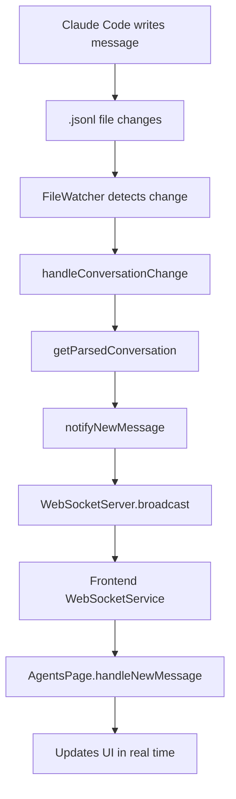

# Agent Chats Manager

The Agent Chats Manager within the `claude-code-templates` analytics dashboard allows you to monitor and analyze Claude agent interactions in real-time. This provides a clear visual flow of how Claude Code processes information and responds.

## How it Works

The process of real-time monitoring of agent chats is illustrated by the following flow:

This flow ensures that any message written by Claude Code is immediately reflected in your dashboard, providing a live view of the conversation.

## Features

-   **Live Session Tracking**: See active conversations and their status in real-time.
-   **Conversation History**: Access complete session logs with export capabilities (CSV/JSON).
-   **Performance Monitoring**: Track Claude Code agent performance and identify optimization opportunities.
-   **Usage Patterns**: Identify your most productive coding sessions and workflows.
