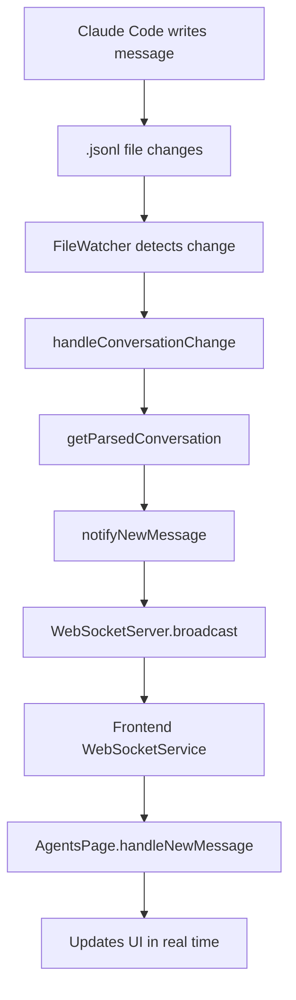

# Analytics Dashboard Overview

The `claude-code-templates` CLI includes a comprehensive analytics dashboard that allows you to monitor and optimize your Claude Code agents and interactions in real-time. This dashboard provides valuable insights into usage patterns, performance metrics, and conversation history.

## Key Features of the Analytics Dashboard

### 📊 Real-time Analytics Dashboard
Monitor and optimize your Claude Code agents with our comprehensive analytics dashboard:
-   **Live Session Tracking**: See active conversations and their status in real-time.
-   **Usage Statistics**: Total sessions, tokens, and project activity with trends.
-   **Conversation History**: Complete session logs with export capabilities (CSV/JSON).
-   **Status Indicators**: PM2-style visual indicators for conversation health.
-   **File Watching**: Automatic updates as you work with Claude Code.
-   **Web Interface**: Clean, terminal-style dashboard at `http://localhost:3333`.
-   **Performance Monitoring**: Track Claude Code agent performance and optimization opportunities.
-   **Usage Patterns**: Identify your most productive coding sessions and workflows.

### 🤖 Agent Chats Manager
Monitor and analyze Claude agent interactions in real-time.



## How to Launch the Analytics Dashboard

You can launch the analytics dashboard using the following command:

```bash
npx claude-code-templates --analytics
# or
npx claude-code-templates --chats
```

Once launched, you can access the web interface in your browser at `http://localhost:3333`.
